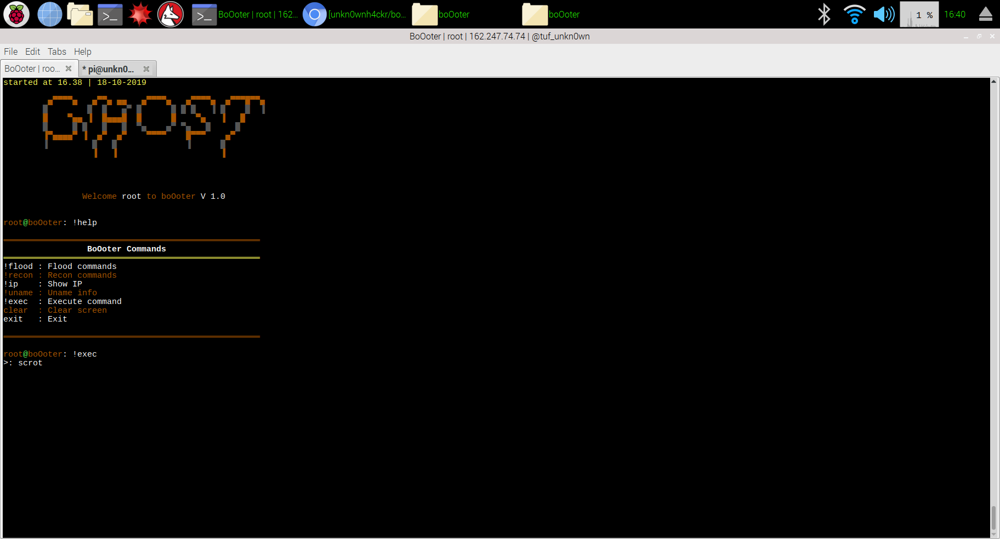

# boOoter
A spooky booter for halloween this python script contains a variety of dos attacks and some information gathering this is not a botnet / ddos tool

(RUN AS ROOT AND CLONE IN THE /root/ FOLDER)

e
# INSTALL
`cd boOoter`

`chmod +x *`

`./install.sh`

# RUN
make sure to have a username
and password to login

`cd boOoter`

`python boOoter.py`

# ADD USER AND PASSWORD
`cd boOoter`

`python adduser.py`

# UPDATE
`cd boOoter`

`python boOoterupdate.py`
# RUN WITH PROXYCHAINS
`cd boOoter`

`python proxy.py`
